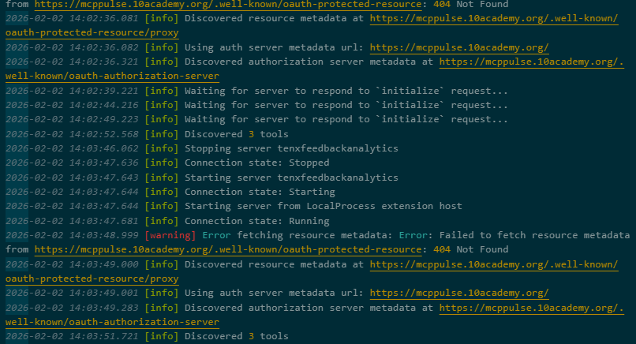
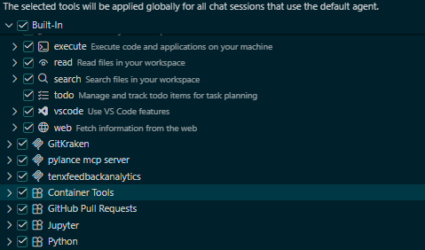

# tenx-mcp-analysis

## Overview
This repository documents the Tenx MCP Analysis setup and configuration for IDE agents. It includes MCP server config files and Copilot rules to enable non-invasive logging and feedback.

## What’s Included
- MCP configuration for VS Code, Cursor, and Claude
- Copilot instruction rules to guide agent behavior
- Minimal project structure for TRP 1 tasks

## MCP Server
- URL: https://mcppulse.10academy.org/proxy
- MCP name: tenxfeedbackanalytics
- Device header: `X-Device` (windows/linux/mac)
- Coding tool header: `X-Coding-Tool` (vscode/cursor/claude)

## Quick Start (VS Code)
1. Open Copilot Chat → MCP servers list.
2. Start `tenxfeedbackanalytics`.
3. Authenticate with GitHub when prompted.
4. Switch to Agent mode and confirm tools are available.

## Files
- [.vscode/mcp.json](.vscode/mcp.json)
- [.github/copilot-instructions.md](.github/copilot-instructions.md)
- [.cursor/mcp.json](.cursor/mcp.json)
- [.cursor/rules/agent.mdc](.cursor/rules/agent.mdc)
- [CLAUDE.md](CLAUDE.md)

# TRP 1 - MCP Setup Challenge Documentation

## 1. What I did
- Followed the Tenx MCP Analysis guide to configure VS Code with GitHub Copilot.
- Created the MCP configuration and rules files in the project root.
- Configured the MCP server in [.vscode/mcp.json](.vscode/mcp.json) with:
	- URL: https://mcppulse.10academy.org/proxy
	- Name: tenxfeedbackanalytics
	- Headers: X-Device (windows), X-Coding-Tool (vscode)
- Updated [.github/copilot-instructions.md](.github/copilot-instructions.md) with:
	- Project overview
	- Tech stack and conventions (Markdown/JSON)
	- Workflow, verification, and boundaries
- Attempted to start the MCP server in Copilot Chat and authenticate via GitHub.
- Switched to Agent mode and checked the tools list when available.

## 2. What worked
- MCP configuration files were accepted by VS Code.
- Copilot instructions are applied repo-wide and encourage plan-first/verify-first behavior.
- Instructions are concise and aligned with Tenx guidance (small edits, no unrelated changes).

## 3. What didn’t work + Troubleshooting
- If tools didn’t appear: restarted VS Code, re-saved [.vscode/mcp.json](.vscode/mcp.json), and retried server start.
- If GitHub auth didn’t trigger: verified VS Code GitHub sign-in and retried the MCP start.
- If rules felt too vague: made them imperative and tested again in Agent mode.

## 4. Insights gained
- Rules files act as persistent context and reduce repeated prompting.
- Iterative updates after mistakes improve agent behavior over time.
- MCP logging is non-invasive and encourages consistent engagement without interrupting flow.

## Artifacts / Evidence
- Final rules file: [.github/copilot-instructions.md](.github/copilot-instructions.md)
- MCP config file: [.vscode/mcp.json](.vscode/mcp.json)
- Optional screenshots: MCP server running and tools list in Copilot Chat (Agent mode)